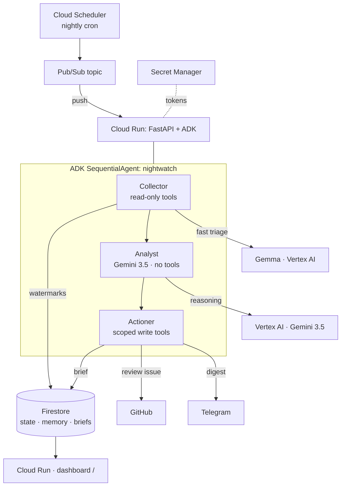

# 🌙 Nightwatch

**An autonomous overnight agent that does your morning triage for you.**
Nightwatch runs on a schedule in the background, watches your wallets / contracts /
markets, uses **Gemini 3.5** to *reason* about what actually matters (not threshold
alerts), and then **takes action** — writing a decision-ready brief, opening review
issues, and sending a digest. It reasons **and** acts; it is not a chatbot.

> Built for the **All Things Agentic Hackathon** — **Taskmaster** category
> (*"Bring Your Own Friction": build an agent that completes a real multi-step chore*).

## Why it exists (the friction)
Manually checking a dozen wallets and markets every morning, reconstructing what happened
overnight, and deciding what needs action is ~30–45 min of tedious, error-prone work.
Nightwatch does that chore autonomously and hands back a brief with the routine
follow-ups already done.

## Architecture



**Flow:** Scheduler → Pub/Sub → Cloud Run fires the pipeline. **Collector** gathers new
signal (read-only tools) and routes a cheap first-pass materiality triage to the open
**Gemma** model, **Analyst** reasons over it with **Gemini 3.5** (no tools = isolated),
**Actioner** completes the chore with scoped write tools, gated on a confidence
threshold. State, cross-run memory, and briefs live in Firestore.

## Mandatory-requirements checklist (All Things Agentic)
- ✅ **Gemini 3.5+** via **Vertex AI** — `app/agents/*` (`GEMINI_MODEL`, `GOOGLE_GENAI_USE_VERTEXAI`).
- ✅ **Google Agent Framework** — Google **ADK** (`SequentialAgent` + `LlmAgent`, `app/agents/pipeline.py`).
- ✅ **Google Cloud infra** — **Cloud Run** (host) + **Pub/Sub** + **Firestore** (+ Cloud Scheduler, Secret Manager).
- ✅ **Category** — Taskmaster (autonomous, background, takes action).
- ➕ **Bonus — 2nd Google model** — **Gemma** (`gemma-4-26b-a4b-it-maas`, managed on Vertex) as a fast triage classifier; deep reasoning stays on Gemini 3.5.

## Repository layout
```
app/
  main.py            FastAPI: /health, / (dashboard), /run, /pubsub/push
  runner.py          runs one cycle via the ADK Runner
  config.py          env-driven settings
  agents/            collector · analyst · actioner · pipeline (SequentialAgent)
  tools/collect.py   read-only tools  (on-chain + market + web-search + Gemma triage)
  tools/act.py       write tools      (brief LIVE; GitHub issue + Telegram digest, no-op until configured)
  memory/store.py    Firestore: watermarks · situation memory · briefs
infra/deploy.sh      gcloud: Cloud Run + Pub/Sub + Scheduler + Firestore
Dockerfile           Cloud Run image
```

## Run it locally
```bash
python -m venv .venv && source .venv/Scripts/activate   # Windows git-bash; use bin/activate on macOS/Linux
pip install -r requirements.txt
cp .env.example .env        # fill in project id + (optional) integration tokens
# Auth for local Vertex + Firestore:
gcloud auth application-default login

uvicorn app.main:app --reload
# then trigger a cycle:
curl -X POST http://localhost:8000/run
# view the brief:
open http://localhost:8000/
```
Prefer ADK's own dev UI while iterating on the agents: `adk web` (points at `app/agents/pipeline.py:root_agent`).

## Deploy to Google Cloud
```bash
PROJECT_ID=your-project REGION=us-central1 bash infra/deploy.sh
```
Deploys to Cloud Run, creates the Firestore DB, and wires Cloud Scheduler → Pub/Sub →
`/pubsub/push` for the nightly autonomous run.

## Wire the GitHub + Telegram integrations (optional)
The Actioner already ships both tools; they stay a clean no-op until their tokens exist, so
this is pure config — no code changes.

**GitHub** (`open_review_issue` → opens an issue per high-confidence item):
1. Create a fine-grained **Personal Access Token** scoped to the target repo with
   **Issues: Read and write**.
2. Set `GITHUB_TOKEN` (the token) and `GITHUB_REPO` (`owner/repo`).

**Telegram** (`send_digest` → DMs you the nightly digest):
1. Message **@BotFather** → `/newbot` → copy the bot token.
2. Send your new bot any message, then read your chat id:
   ```bash
   curl "https://api.telegram.org/bot<YOUR_BOT_TOKEN>/getUpdates"   # → result[].message.chat.id
   ```
3. Set `TELEGRAM_BOT_TOKEN` (the token) and `TELEGRAM_CHAT_ID` (the id).

**Where to put them**
- **Local:** add the four values to `.env` (see `.env.example`); `POST /run` then fires for real.
- **Cloud Run:** `export` them (or source your `.env`) before `bash infra/deploy.sh` — the
  script pushes the two *tokens* into **Secret Manager**, grants the runtime service account
  read access, and passes the non-secret ids (`GITHUB_REPO`, `TELEGRAM_CHAT_ID`) as env vars.
  Any token left unset is skipped and stays a no-op.

If a token is wrong, the tool now returns the provider's own error (e.g. GitHub
`Bad credentials`, Telegram `chat not found`) in the run result instead of failing silently.

## Securing the run trigger
The service is deployed `--allow-unauthenticated` so the dashboard is public, but the
**trigger endpoints are token-gated** so nobody can run up Vertex cost:

- `POST /run` and `/pubsub/push` require a shared **`RUN_TOKEN`** — `deploy.sh` creates it
  once as the Secret Manager secret **`nightwatch-run-token`** and injects it. `/` and
  `/health` stay open. Locally, `RUN_TOKEN` unset ⇒ the trigger endpoints are open.
- Trigger a run by hand:
  ```bash
  TOKEN=$(gcloud secrets versions access latest --secret=nightwatch-run-token)
  curl -X POST "$SERVICE_URL/run" -H "Authorization: Bearer $TOKEN" \
       -H "Content-Type: application/json" -d '{}'
  ```
  The dashboard's **Run now** button prompts for the same token (never embedded in the page).
- The scheduled path passes the token via the Pub/Sub push URL (`?token=…`) since Pub/Sub
  push can't set custom headers. **Caveat:** that means the token appears in the push
  subscription config and Cloud Run request logs (visible to project members). For stricter
  hygiene, switch `/pubsub/push` to Pub/Sub **OIDC** auth.

## Status / what's live
Structure, agents, deploy path, and dashboard are **real**. Data tools:
- ✅ **`fetch_market`** — live CoinGecko `/simple/price` (USD + 24h change).
- ✅ **`fetch_onchain`** — live blockchain.com explorer gateway (ETH `0x…`, BTC), with
  Firestore watermark dedupe so only NEW transactions surface (seeds silently first run).
- ✅ **`web_search`** — live **Gemini + Google Search grounding** (`google-genai`): a
  grounded summary plus real source citations `{title, url, snippet}`, no extra API key.
- ✅ **`write_brief`** — persists to Firestore (powers the dashboard).
- 🔶 **`open_review_issue` / `send_digest`** — real, fail-soft code, now **deploy-wired via
  Secret Manager**; supply `GITHUB_*` / `TELEGRAM_*` to activate
  (see [Wire the integrations](#wire-the-github--telegram-integrations-optional)).

All Collector tools are live. The two 🔶 items are pure config: drop in the tokens and they
fire — no agent code changes.

**Live deployment (verified 2026-08-09):** shipped to Cloud Run via `bash infra/deploy.sh` —
`/health`, the rendered dashboard, and a full `POST /run` cycle (Vertex reasoning → Firestore
write, from the runtime service account) all confirmed against the running service; Pub/Sub
topic + push subscription and the nightly Cloud Scheduler job are wired.

**Model note:** Nightwatch runs **`gemini-3.5-flash`** on Vertex AI — satisfying the
"Gemini 3.5+" mandate. Key gotcha: Vertex serves 3.x models **only from the `global`
endpoint** (regional endpoints like `us-central1` list them but 404 on generate), so
`GOOGLE_CLOUD_LOCATION=global` for Gemini while Cloud Run, Firestore, Pub/Sub, and
Scheduler stay in `us-central1`. (`gemini-3.5-pro` doesn't exist yet; `gemini-3.6-flash`
is available as an even-newer option.)

The dashboard renders the brief (Markdown → HTML) with severity color-coding, dark mode, and a
"Run now" trigger — served straight from Firestore.

> **ADK version note:** the `Runner`/`Session` calls in `app/runner.py` are the parts
> most likely to shift between ADK releases. If an import or signature fails, check the
> [ADK docs](https://google.github.io/adk-docs/) and adjust `runner.py` only.

## Demo checklist (the 4-min video is 30% of the score)
1. State the friction + value prop (~30s).
2. Walk the architecture diagram (~30s).
3. **Live, unedited run:** `POST /run`, show Cloud Run logs streaming the Collector →
   Analyst → Actioner hand-off, Firestore docs updating, the GitHub issue + Telegram
   digest landing, and the dashboard refreshing (~2 min).
4. **Proof of Google Cloud:** Cloud Run dashboard, Vertex AI logs, the `.run.app` URL,
   Pub/Sub metrics (~40s).
5. Impact recap (~20s).

## License
MIT — see [LICENSE](LICENSE).
