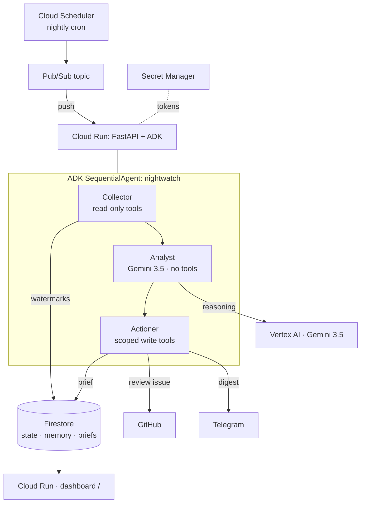

# 🌙 Nightwatch

**An autonomous overnight agent that does your morning triage for you.**
Nightwatch runs on a schedule in the background, watches your wallets / contracts /
markets, uses **Gemini 3.5** to *reason* about what actually matters (not threshold
alerts), and then **takes action** — writing a decision-ready brief, opening review
issues, and sending a digest. It reasons **and** acts; it is not a chatbot.

> Built for the **All Things Agentic Hackathon** — **Taskmaster** category
> (*"Bring Your Own Friction": build an agent that completes a real multi-step chore*).

## Why it exists (the friction)
Manually checking a dozen wallets and markets every morning, reconstructing what happened
overnight, and deciding what needs action is ~30–45 min of tedious, error-prone work.
Nightwatch does that chore autonomously and hands back a brief with the routine
follow-ups already done.

## Architecture



**Flow:** Scheduler → Pub/Sub → Cloud Run fires the pipeline. **Collector** gathers new
signal (read-only tools), **Analyst** reasons over it with Gemini (no tools = isolated),
**Actioner** completes the chore with scoped write tools, gated on a confidence
threshold. State, cross-run memory, and briefs live in Firestore.

## Mandatory-requirements checklist (All Things Agentic)
- ✅ **Gemini 3.5+** via **Vertex AI** — `app/agents/*` (`GEMINI_MODEL`, `GOOGLE_GENAI_USE_VERTEXAI`).
- ✅ **Google Agent Framework** — Google **ADK** (`SequentialAgent` + `LlmAgent`, `app/agents/pipeline.py`).
- ✅ **Google Cloud infra** — **Cloud Run** (host) + **Pub/Sub** + **Firestore** (+ Cloud Scheduler, Secret Manager).
- ✅ **Category** — Taskmaster (autonomous, background, takes action).

## Repository layout
```
app/
  main.py            FastAPI: /health, / (dashboard), /run, /pubsub/push
  runner.py          runs one cycle via the ADK Runner
  config.py          env-driven settings
  agents/            collector · analyst · actioner · pipeline (SequentialAgent)
  tools/collect.py   read-only tools  (on-chain / market / web-search)  [STUBS -> wire real APIs]
  tools/act.py       write tools      (brief / GitHub issue / Telegram digest)
  memory/store.py    Firestore: watermarks · situation memory · briefs
infra/deploy.sh      gcloud: Cloud Run + Pub/Sub + Scheduler + Firestore
Dockerfile           Cloud Run image
```

## Run it locally
```bash
python -m venv .venv && source .venv/Scripts/activate   # Windows git-bash; use bin/activate on macOS/Linux
pip install -r requirements.txt
cp .env.example .env        # fill in project id + (optional) integration tokens
# Auth for local Vertex + Firestore:
gcloud auth application-default login

uvicorn app.main:app --reload
# then trigger a cycle:
curl -X POST http://localhost:8000/run
# view the brief:
open http://localhost:8000/
```
Prefer ADK's own dev UI while iterating on the agents: `adk web` (points at `app/agents/pipeline.py:root_agent`).

## Deploy to Google Cloud
```bash
PROJECT_ID=your-project REGION=us-central1 bash infra/deploy.sh
```
Deploys to Cloud Run, creates the Firestore DB, and wires Cloud Scheduler → Pub/Sub →
`/pubsub/push` for the nightly autonomous run.

## Status / what's stubbed
This is the Week-1 skeleton — the **structure, agents, deploy path, and dashboard are
real**; the data tools in `app/tools/collect.py` return sample data (marked `_stub`) so
the whole pipeline runs today. Week 2 = wire the real explorer/price/search APIs and the
action integrations. The agent code doesn't change when you swap stubs for live calls.

> **ADK version note:** the `Runner`/`Session` calls in `app/runner.py` are the parts
> most likely to shift between ADK releases. If an import or signature fails, check the
> [ADK docs](https://google.github.io/adk-docs/) and adjust `runner.py` only.

## Demo checklist (the 4-min video is 30% of the score)
1. State the friction + value prop (~30s).
2. Walk the architecture diagram (~30s).
3. **Live, unedited run:** `POST /run`, show Cloud Run logs streaming the Collector →
   Analyst → Actioner hand-off, Firestore docs updating, the GitHub issue + Telegram
   digest landing, and the dashboard refreshing (~2 min).
4. **Proof of Google Cloud:** Cloud Run dashboard, Vertex AI logs, the `.run.app` URL,
   Pub/Sub metrics (~40s).
5. Impact recap (~20s).

## License
MIT — see [LICENSE](LICENSE).
